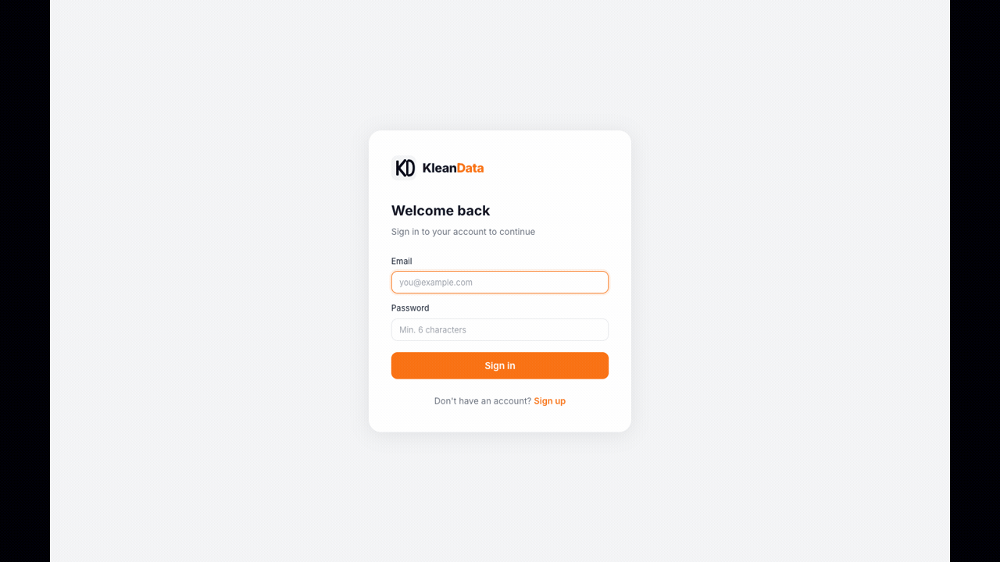
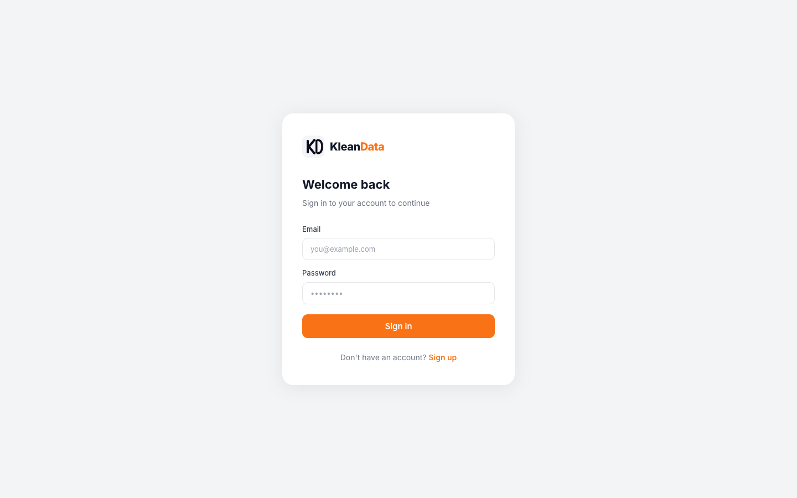
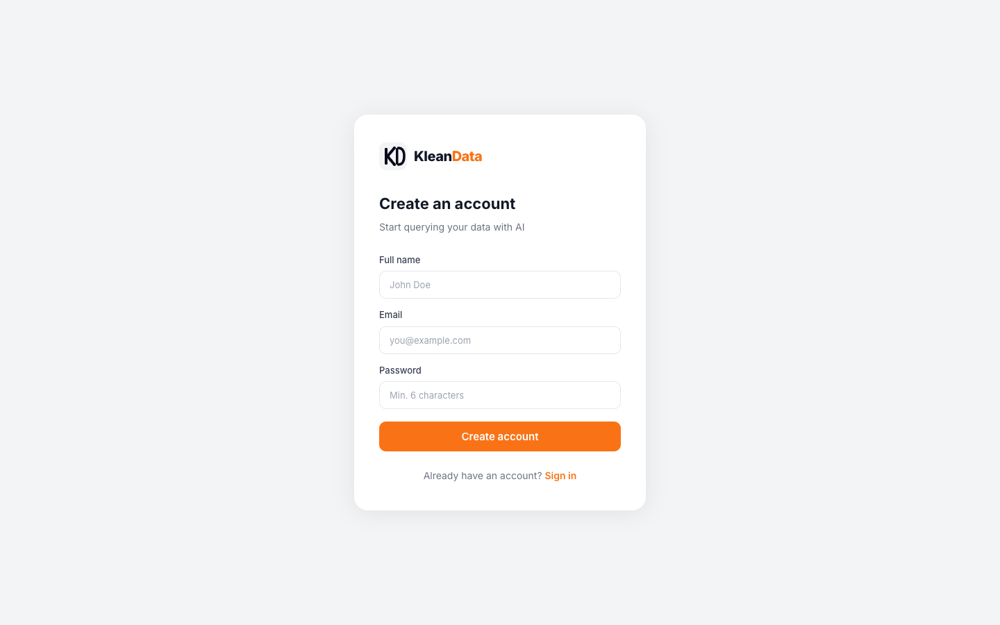
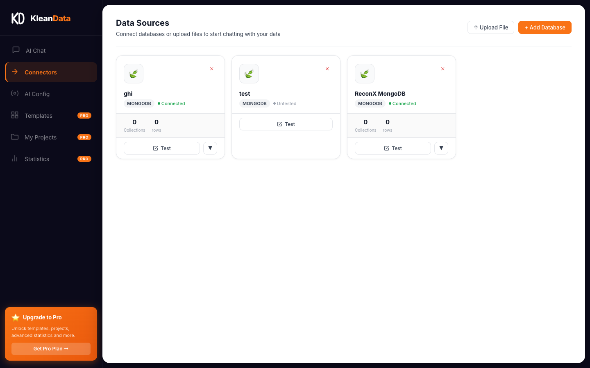
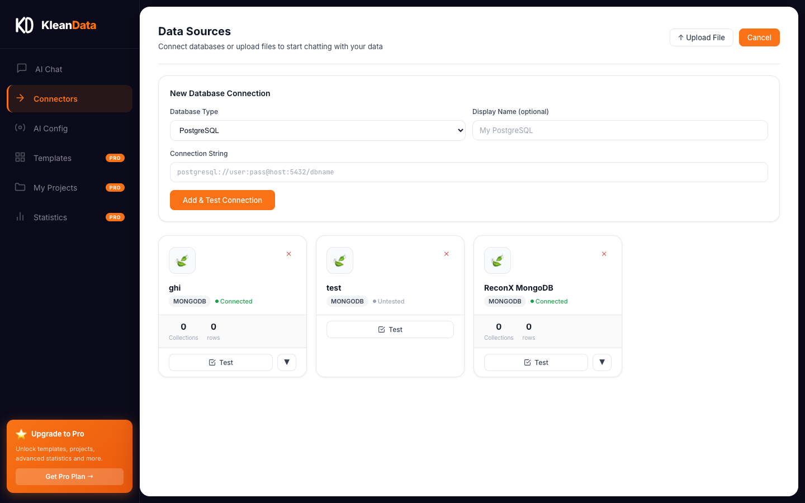
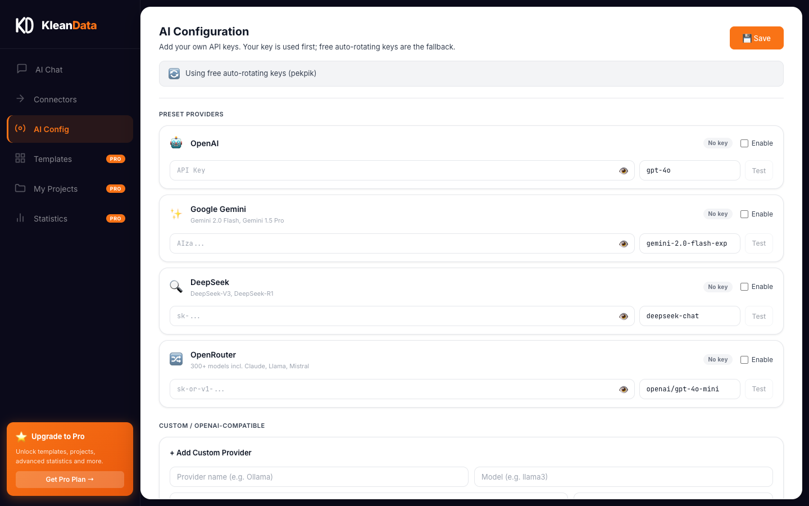
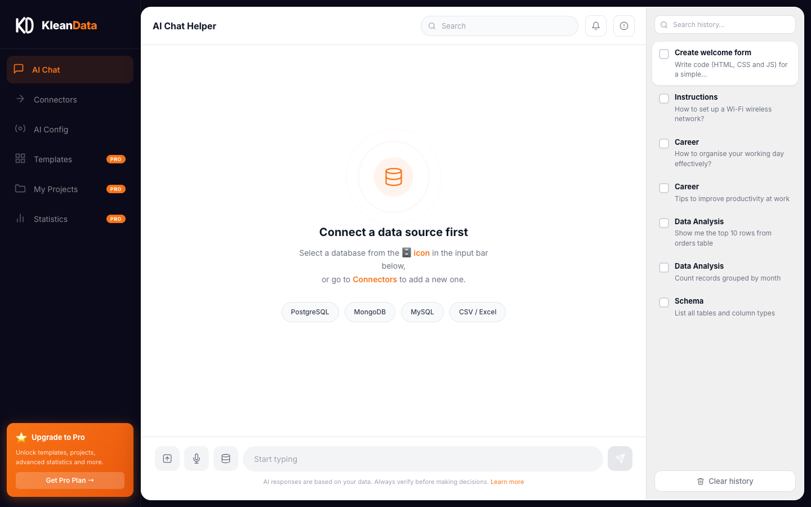

<div align="center">

# Klean Data

**Chat with your databases using natural language — powered by AI**

[](LICENSE)
[](https://python.org)
[](https://react.dev)
[](https://fastapi.tiangolo.com)



</div>

---

## What is Klean Data?

Klean Data lets you connect any database or upload a spreadsheet and talk to your data in plain English. Ask questions, get SQL or MongoDB queries generated automatically, review the plan, and approve before anything runs.

No SQL knowledge required. Your data never leaves your machine.

---

## Screenshots

| Login | Sign Up |
|-------|---------|
|  |  |

| AI Chat | Connectors Grid |
|---------|----------------|
|  |  |

| Add Database | AI Configuration |
|-------------|-----------------|
|  |  |

| Notifications Popover |
|----------------------|
|  |

---

## Features

### AI Chat
- Ask anything about your data in plain English
- AI generates a **step-by-step action plan** — you approve before anything runs
- **Thumbs up / down** feedback on responses
- **Copy answer** button on every response
- **Regenerate** last response
- **Voice input** — click the mic, speak your query
- **Upload files** directly from the chat bar (CSV, Excel)

### Data Connectors
- PostgreSQL, MySQL, SQLite, MongoDB
- CSV and Excel file upload
- Auto-detects schema — tables, columns, row counts
- **Card grid layout** — active source glows orange
- Test connection before querying

### AI Configuration
- Add your own API keys (OpenAI, Gemini, DeepSeek, OpenRouter)
- Add any OpenAI-compatible endpoint (Ollama, LM Studio, etc.)
- Test keys before saving
- Falls back to free rotating community keys if no key is set

### UI / UX
- 3-panel layout: dark sidebar + white chat area + history panel
- **History panel** — search past queries, checkbox select, clear
- Notifications bell with contextual alerts
- Info popover — connection status, message stats, keyboard shortcuts
- Login & Sign Up pages
- **PRO Plan** card with Coming Soon modal
- PRO badges on Templates, My Projects, Statistics

---

## Tech Stack

| Layer | Technology |
|-------|-----------|
| Frontend | React 18 + TypeScript + Vite |
| Routing | React Router v6 |
| Backend | FastAPI + Python 3.10+ |
| Databases | psycopg2, pymongo, mysql-connector, sqlite3 |
| AI | OpenAI-compatible API (any provider) |

---

## Quick Start

### 1. Backend

```bash
cd backend
pip install -r requirements.txt
uvicorn main:app --port 8766 --reload
```

### 2. Frontend

```bash
npm install
npm run dev
```

Open [http://localhost:5173](http://localhost:5173)

---

## Configuration

### Environment Variables

| Variable | Default | Description |
|----------|---------|-------------|
| `OPENAI_API_KEY` | — | Your own OpenAI key (optional) |
| `OPENAI_BASE_URL` | deepseek API | Base URL for AI requests |
| `OPENAI_MODEL` | deepseek-chat | Model name |

### Adding Your Own API Key (Recommended)

1. Open the app → **AI Config** tab in the sidebar
2. Pick a provider (OpenAI, Gemini, DeepSeek, OpenRouter) or add a custom one
3. Paste your API key → click **Test** → **Save**

The app uses your key first and falls back to free rotating community keys.

---

## Project Structure

```
datalib/
├── src/
│   ├── components/
│   │   ├── Chat.tsx            # Main chat interface
│   │   ├── ConnectorsPanel.tsx # Database connector grid
│   │   ├── HistoryPanel.tsx    # Right-side history panel
│   │   ├── KdLogo.tsx          # KD geometric SVG logo
│   │   ├── ProModal.tsx        # Coming Soon modal
│   │   ├── SettingsPanel.tsx   # AI Config panel
│   │   └── Sidebar.tsx         # Dark left sidebar
│   ├── pages/
│   │   ├── Login.tsx
│   │   └── Signup.tsx
│   ├── context/
│   │   └── DataLibContext.tsx  # Global state
│   └── App.tsx                 # Router + layout
├── backend/
│   ├── main.py                 # FastAPI app + endpoints
│   ├── nlq_engine.py           # Natural language to query engine
│   ├── key_manager.py          # API key rotation
│   ├── key_fetcher.py          # Community key updater
│   └── user_settings.py        # User API key storage
└── screenshots/
    └── demo.gif
```

---

## Keyboard Shortcuts

| Key | Action |
|-----|--------|
| `Enter` | Send message |
| `Shift + Enter` | New line in input |

---

## License

MIT — free to use, modify, and distribute.

---

<div align="center">
Built with love by <strong>Klean Data</strong>
</div>
